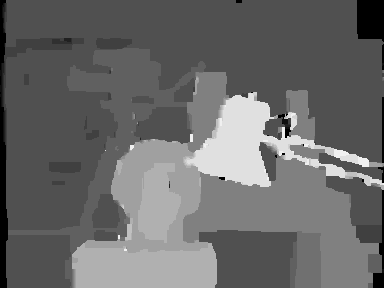

# Belief Propagation for Stereo Matching (Accelerated)
A C++ implementation of Loopy Belief Propagation for stereo matching. It uses the "min-sum" variation of the algorithm and the "Accelerated" (Right-Left-Down-Up sweep) message update schedule.

## Input Image
The Tsukuba stereo image that used as input.

   

## Output Image
The disparity map that created at the output.

   

